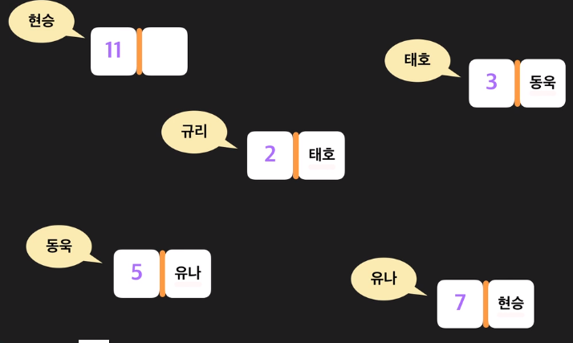

#자료구조

###스토리지 
데이터가 영구적으로 저장되는곳

데이터저장,받아오는데 오래걸림
비유 - 창고 

##메모리 
데이터를 임시로 저장 

데이터저장,받아오는데 빠르다
당장 사용하는 데이터를 사용 

메모리는 임의의 접근을 한다 
---
###레퍼런스
데이터에 접근할수 있게 해주는 값 
주소 = 레퍼런스

x = 95
95가 저장된 메모리 주소를 가진다 
변수를 계산할때 저장된 값을 알아서 받아서 온다 
 
---
###배열
####1. 리스트 ,배열 

 | 배열| 리스트 |
|:--------|:--------|
| 크기가 고정| 크기가 가변적 | 
| 같은 타입의 데이터만 담을수 있다 | 다양한 타입의 값을 담을수 있다 | 

리스트 레퍼런스로 구성해서 값을 가르키기만 한다
그래서 다양한 타입을 저장할수 있다 

####2. 배열 접근,탐색 시간 
- 배열 접근 연산: O(1)
- 배열 탐색 연산: O(n)

####3. 정적,동적 배열 
- 정적 배열 : 크기 고정 (요소 수 제한 )
- 동적 배열 : 크기 변함 (요소 계속 추가 가능 )

동적 배열에 추가 연산을 하는 경우 
1. 정적 배열에 남은 공간 있을때 : O(1) <- 자주 일어남
2. 정적 배열이 꽉 찼을때 : O(n) <- 가끔 일어남 

####4. 분할 상환분석 - 할부 
같은 동작을 n번 했을때 드는 시간이 X일때 : 동작을 한번 하는데 걸린 시간 : x/n

####5. 삽입 연산 시간 복잡도 
1. 정적 배열에 남은 공간 있을때 : O(n)
2. 정적 배열이 꽉 찼을때 : O(n)

####6. 삭제 연산 시간 복잡도 
1. 정적 배열에 남은 공간 있을때 : O(n)
2. 정적 배열이 꽉 찼을때 : O(1)

 | \ | 배열 |리스트 |
|:--------|:--------|:--------|
| 접근| O(1) | O(1) | 
| 탐색 | O(n) | O(n) | 
| 삽입 | N/A | O(n) ,맨뒤 O(1) | 
| 삭제 | N/A | O(n), 맨뒤 O(1) | 

동적 배열이 낭비하는 공간 : O(n-2)

---
### 링크드 리스트 
- 데이터를 순서대로 저장해준다 
- 요소를 계속 추가할 수있다 

노드 
data,next 

